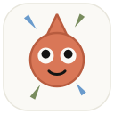
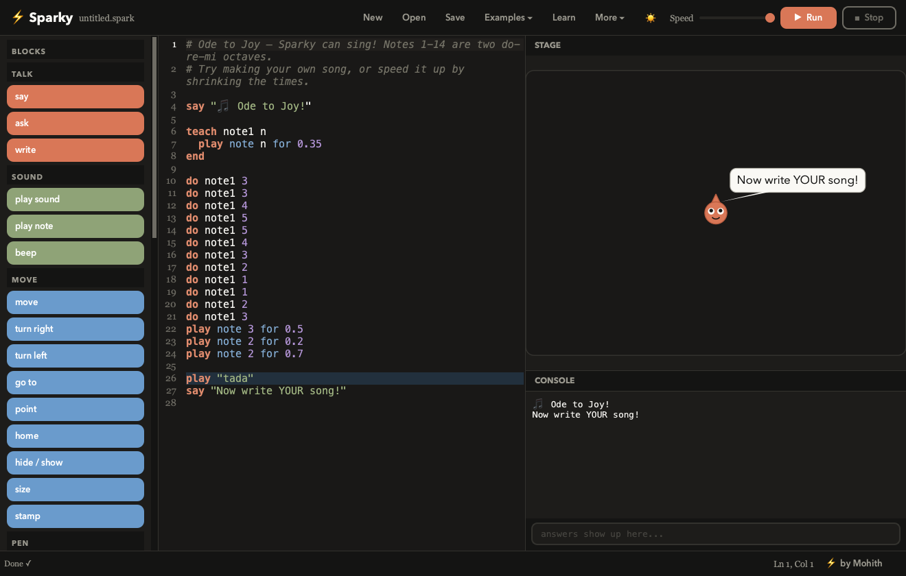
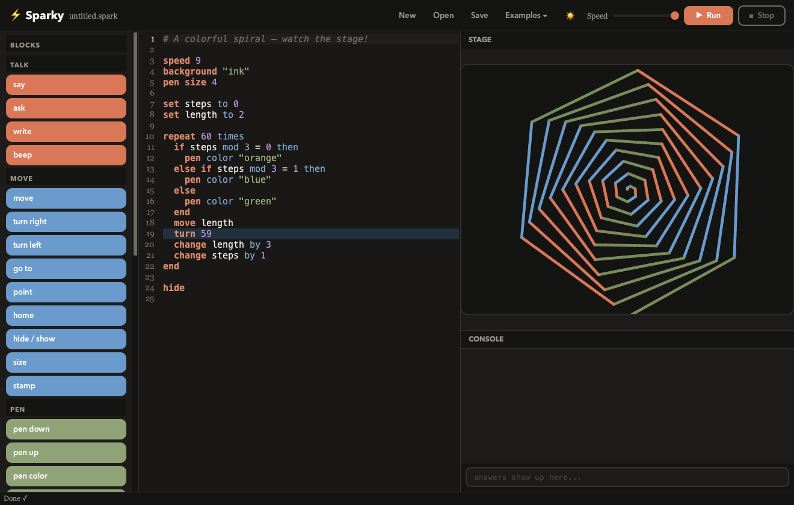
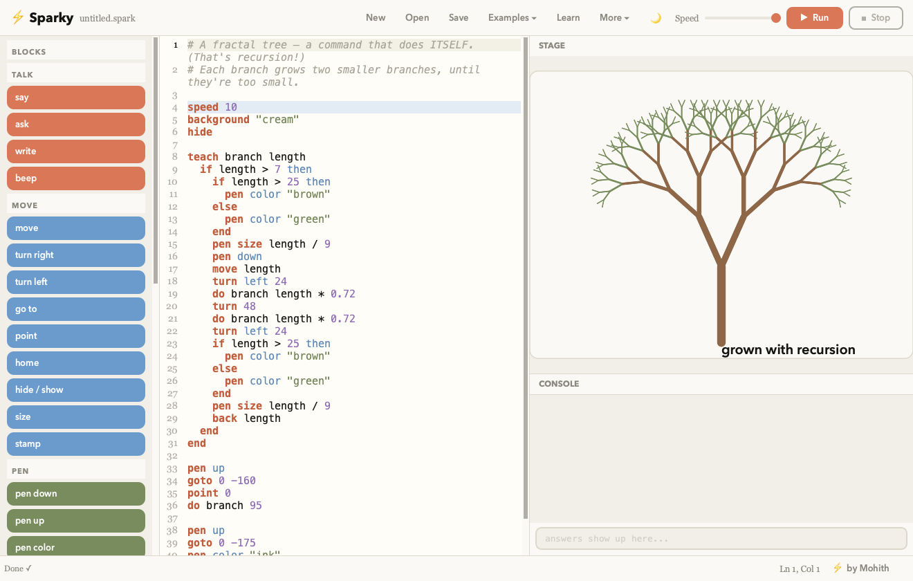
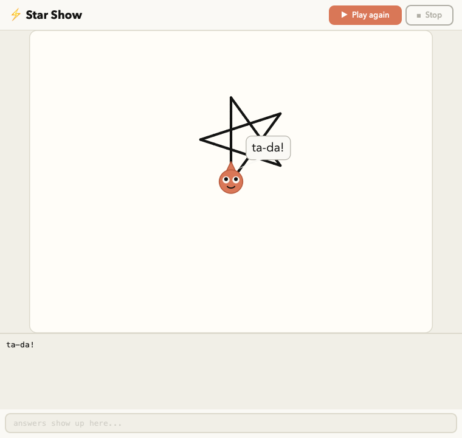

# ⚡ Sparky



A coding platform for kids (and grown-ups): a friendly programming
language plus a fast, fully native IDE. Think Scratch's spirit, but you
write (and click your way into) **real text code**.

Built with Python + PyQt6 — real native widgets, **no Chromium, no
Electron, no browser engine anywhere**. Runs on macOS, Windows,
and Linux.

Created by **Mohith** — [mohith2309.github.io](https://mohith2309.github.io)

## Install it (easiest)

Download Sparky from **https://sparky-code.web.app** — every download has
everything inside (Python, Qt, examples, lessons), nothing else to install.

| Computer | Download | Install |
|---|---|---|
| Mac (Apple silicon) | `Sparky-Installer.dmg` | Open it, drag Sparky into Applications |
| Windows 10/11 (64-bit) | `Sparky-Setup.exe` | Run it; no admin needed; adds desktop + Start menu shortcuts |
| Linux PC (x86_64) | `Sparky-Linux-x86_64.tar.gz` | Unpack, run `./install.sh` (no sudo) or `./sparky` |
| Raspberry Pi 4/5, ARM64 Linux | `Sparky-Linux-arm64.tar.gz` | Same as Linux PC |

Linux needs Python 3.10+, which desktops already have.

**First open:** the downloads aren't signed with paid developer
certificates, so the system asks once.
- **Mac:** it says it *"can't verify the app is free of malware"*. Open
  **System Settings → Privacy & Security**, scroll down, press **Open
  Anyway**. (Or: `xattr -dr com.apple.quarantine /Applications/Sparky.app`)
- **Windows:** if it says *"Windows protected your PC"*, press **More info →
  Run anyway**.

Your programs, gallery, and extensions live in a friendly `~/Sparky`
folder the app creates on first launch.

## Or run from source

| Platform | Double-click |
|---|---|
| macOS | `Sparky.command` |
| Windows | `sparky.bat` |
| Linux | `sparky.sh` |

First launch sets up its own environment. Or from a terminal:

```
cd sparky
.venv/bin/python -m sparky            # open the IDE
.venv/bin/python -m sparky run examples/spiral.spark    # run in terminal
.venv/bin/python -m sparky play examples/fireworks.spark  # player window
```

The language itself is pure standard library — only the IDE needs PyQt6
(installed automatically into `.venv` on first launch).

## Screenshots

| Light | Dark |
|---|---|
|  |  |

A fractal tree drawn by 15 lines of kid code (recursion!), and an
exported app running in the player:

| Fractal tree | Player |
|---|---|
|  |  |

## What's in the IDE

- **Block palette** — click a block, real Sparky code appears at your
  cursor. Kids graduate from clicking to typing naturally.
- **Real editor** — syntax colors, line numbers, autocomplete,
  auto-indent, and a blue highlight that follows the running line.
- **Stage** — a Scratch-style canvas where Sparky (the little coral
  spark) walks, turns, draws, stamps, and talks in speech bubbles.
- **Console** — `say` prints here; `ask` waits here for an answer.
- **Kid-friendly errors** — `Oops! Line 2: I don't know the command
  "mvoe". Did you mean "move"?` — with the line highlighted orange.
- Run/Stop, a live speed slider (1 slow → 10 instant), light & dark
  themes, Examples menu, open/save `.spark` files.
- **Learn** — 10 built-in interactive lessons, challenges, and a full
  language reference. Every lesson loads runnable starter code.
  (The written version is [GUIDE.md](GUIDE.md).)
- **Make an App** — package a program into a folder with double-click
  Play launchers (Mac/Windows/Linux) that run it in the Sparky player:
  stage + console, no editor.
- **Community** — share `.spark` files; ones dropped in `gallery/`
  show up in the Community window.
- **Sounds** — `play "pop"` (7 built-in effects) and `play note 4 for
  0.5` (real notes — see the Music example, it sings Ode to Joy).
  Every sound is synthesized from scratch, no audio files shipped.
- **Extensions** — drop a `.py` file in `extensions/` with a
  `register(api)` function and it adds new block categories.
  `shape_pack.py` is the sample to copy.
- **Settings** — theme, default speed, code text size, autocomplete,
  sounds & volume. Editor zoom with Cmd/Ctrl `+` `-` `0`. Everything
  is remembered between sessions, and a welcome screen greets the
  first launch.

## New in 1.1

- **Language:** lists, `for each` / `for i from 1 to 10` loops, commands that
  `give back` answers (recursion works), and 25 built-in functions.
- **Python bridge:** Show as Python turns any Sparky program into real Python.
- **A real IDE:** tabs, file explorer, find/replace, command palette, quick
  open, go to line, comment toggling — and it runs Python, JavaScript, HTML
  and anything you add a command for.
- **VS Code themes and snippets** from Open VSX (Sparky never runs extension code).
- **Bring-your-own AI helper:** Claude (official Anthropic SDK), OpenAI, Gemini,
  Groq, OpenRouter, or local Ollama / LM Studio, with tutor mode and your own
  instructions.

## The Sparky language in 60 seconds

```
say "hello!"                     ask "Your name?" into name
set score to 0                   change score by 1
if score > 5 then ... else ... end
repeat 10 times ... end          repeat until score = 3 ... end
forever ... end                  stop loop / stop program
wait 0.5                         speed 8

move 100        turn 90          turn left 45      point 0
goto 0 0        home             hide / show       size 150
pen down/up     pen color "red"  pen size 5        stamp
background "ink"        clear    write "hi"        beep

teach square length              do square 50
  repeat 4 times
    move length
    turn 90
  end
end
```

Math: `+ - * / mod`, `round x`, `abs x`, `random 1 to 10`.
Comparing: `= > < >= <=`, `is`, `is not`, `and`, `or`, `not`.
`+` joins text: `say "Hi " + name`. Comments start with `#`.

The stage works like Scratch: (0,0) is the center, y goes **up**,
heading 0 points up and `turn` goes clockwise.

## Project layout

- `sparky/lang/` — tokenizer → parser → interpreter (pure stdlib)
- `sparky/ide/` — the PyQt6 IDE (editor, stage, blocks, runner, themes)
- `examples/` — programs in the IDE's Examples menu
- `tests/test_lang.py` — run with `python3 tests/test_lang.py`
- `scripts/build_all.sh` — builds all four downloads into `build/release/`
  (Mac app via PyInstaller, Windows installer via pynsist + NSIS,
  Linux packages) — all from a Mac; see the header of each build script

Made by Mohith as a learning project — the whole thing is meant to be
read, poked at, and extended.
